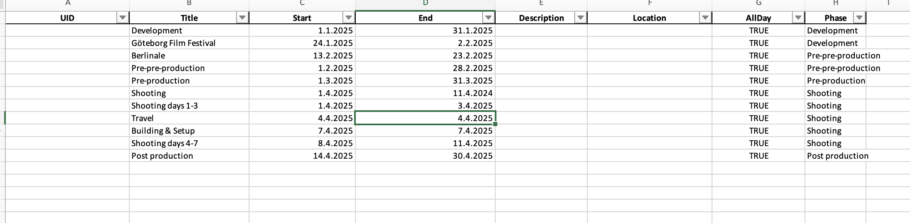

# Vertical Calendar Export

*Note: This code and the readme.md file were created with ChatGPT (version o1-preview). I don’t have prior coding knowledge, and the same bot guided me through navigating GitHub. However, the code appears to work for my purposes.*

This Python script reads calendar data from an Excel file and creates a vertically oriented monthly calendar in a new Excel file. Events are organized by month, with each month presented in a grid by days and customizable formatting options, including colors for different production phases.

## Table of Contents

- [Example Images](#example-images)
- [Requirements](#requirements)
- [Project Structure](#project-structure)
- [Configuration](#configuration)
- [Usage](#usage)
- [Virtual Environment](#virtual-environment)
- [File Descriptions](#file-descriptions)
- [Customization](#customization)
- [License](#license)
- [Contact](#contact)

## Example Images




## Requirements

This project requires the following packages:
- `pandas`
- `openpyxl`

You can install them with:
```bash
pip install pandas openpyxl
```

## Project Structure

- `Calendar_table.xlsx` - The input Excel file containing calendar events.
- `calendar_output_vertical.xlsx` - The output Excel file generated by the script.

## Configuration

### Input File

Ensure `Calendar_table.xlsx` contains the following columns:
- `Start` - Start date of the event.
- `End` - End date of the event.
- `Phase` - Event phase (color-coded in the script).

### Phase to Color Mapping

The following color mappings are applied to phases in the calendar:
- `Development`: Yellow
- `Pre-pre-production`: Orange
- `Pre-production`: Light Green
- `Shooting`: Green
- `Post production`: Brown

You can customize these mappings by updating the `PHASE_COLORS` dictionary in the script.

## Usage

Run the script with:

```bash
python <script_name>.py
```

This will create a new file `calendar_output_vertical.xlsx` with events organized by month and phase.

## Virtual Environment

It’s recommended to run this project in a virtual environment to manage dependencies. You can set one up with:

```bash
python -m venv venv
source venv/bin/activate  # On Windows use `venv\Scripts\activate`
```

Then install the required packages:

```bash
pip install -r requirements.txt
```

## File Descriptions

- **Main Script** - Reads data, applies formatting, and generates a monthly calendar.
- **Output File** - Yearly calendar in Excel format with organized and color-coded events.

## Customization

You can adjust the `PHASE_COLORS` dictionary in the script to define custom colors for event phases.

## License

This project is licensed under the MIT License. See [MIT License](https://choosealicense.com/licenses/mit/) for details.

## Contact

For any questions or feedback, please contact Joonas Kauppinen at joonaskauppinen@hotmail.com.
